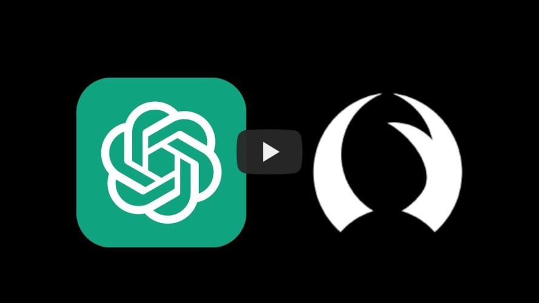

:::note

This assumes you have Talon installed. If you are new to Talon check out the Quickstart on [https://talon.wiki/](https://talon.wiki/)

:::

1. Download or `git clone` this repo into your Talon user directory.
1. [Obtain an OpenAI API key](https://platform.openai.com/signup).

1. Create a Python file anywhere in your Talon user directory.
1. Set the key environment variable within the Python file

:::caution
 
Make sure you do not push the key to a public repo!

:::

```python
# Example of setting the environment variable
import os

os.environ["OPENAI_API_KEY"] = "YOUR-KEY-HERE"
```

### Quickstart Video

[](https://www.youtube.com/watch?v=FctiTs6D2tM "Talon-AI-Tools Quickstart")