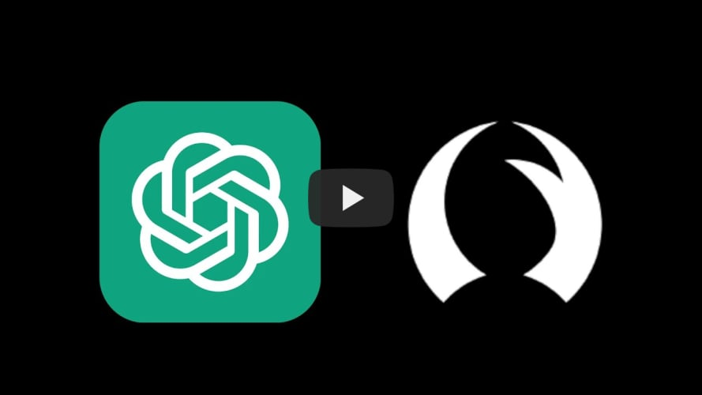

# Talon-AI-Tools

**Control large language models and AI tools through voice commands using the [Talon Voice](https://talon.wiki) dictation engine.**

This functionality is especially helpful for users who:

- want to quickly edit text and fix dictation errors
- code by voice using tools like [Cursorless](https://www.cursorless.org/)
- have health issues affecting their hands and want to reduce keyboard use
- want to speed up their workflow and use AI commands across the entire desktop

**Prompts and extends the following tools:**

- Github Copilot
- OpenAI API (with any GPT model) or [simonw/llm CLI](https://github.com/simonw/llm) for text generation and processing
  - Any OpenAI compatible model endpoint can be used (Azure, local llamafiles, etc)
- OpenAI API for image generation and vision

## Setup:

1. Download or `git clone` this repo into your Talon user directory.
2. Choose one of the following three options to configure LLM access (unless you want to exclusively use this with Copilot):

### Option 1 (recommended): simonw/llm CLI

1. Install [simonw/llm](https://github.com/simonw/llm#installation) and set up one or more models to use.
2. Add the following lines to your settings:

```
user.model_endpoint = "llm"
# If the llm binary is not found on Talon's PATH, uncomment and set:
# user.model_llm_path = "/path/to/llm"
```

3. Choose a model in settings:

```
user.openai_model = "claude-3.7-sonnet"  # or whichever model you installed
```

4. By default, all model interactions will be logged and viewable via `llm logs`. If you prefer, you can disable this with `llm logs off`.

### Option 2: Direct OpenAI API Access

1. [Obtain an OpenAI API key](https://platform.openai.com/signup).
2. Create a Python file anywhere in your Talon user directory.
3. Set the key environment variable within the Python file:

> [!CAUTION]
> Make sure you do not push the key to a public repo!

```python
# Example of setting the environment variable
import os

os.environ["OPENAI_API_KEY"] = "YOUR-KEY-HERE"
```

### Option 3: Custom Endpoint URL

1. Add the following line to settings to use your preferred endpoint:

```
user.model_endpoint = "https://your-custom-endpoint.com/v1/chat/completions"
```

This works with any API that follows the OpenAI schema, including:

- Azure OpenAI Service[]
- Local LLM servers (e.g., llamafiles, ollama)
- Self-hosted models with OpenAI-compatible wrappers

## Usage

See the [GPT](./GPT/readme.md) or [Copilot](./copilot/README.md) folders for usage examples.

### Quickstart Video

[](https://www.youtube.com/watch?v=FctiTs6D2tM "Talon-AI-Tools Quickstart")
